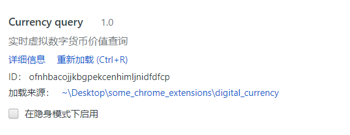
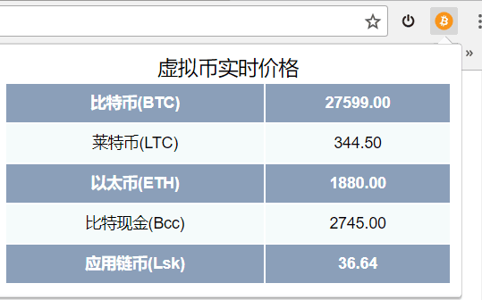
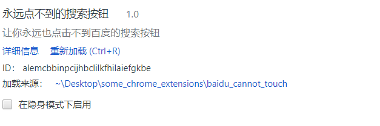
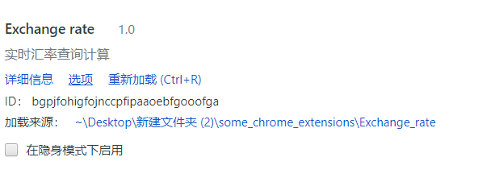
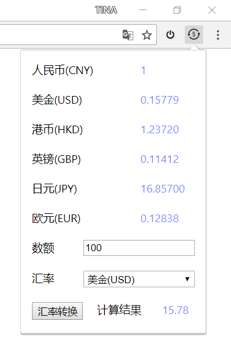
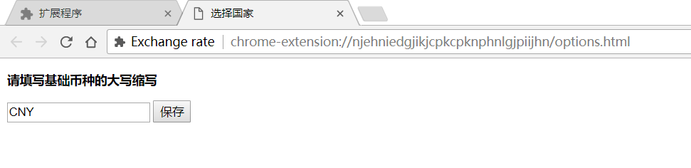
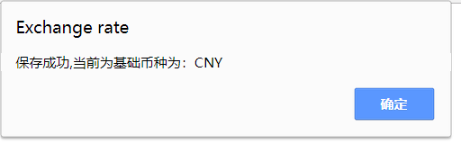

# some_chrome_extensions
一些chrome扩展

## 使用扩展

 - 在chrome的`扩展程序`中选择`开发者模式`，点击`加载已解压的扩展`后选择项目目录（如Exchange_rate）。
 - 在chrome的`扩展程序`中选择`开发者模式`，直接拖入打包好的`.crx`文件。

## 扩展说明

### digital_currency

可以进行对比特币，莱特币，以太坊币等虚拟货币的实时价值查询。

### baidu_cannot_touch

根据[《Chrome扩展及应用开发（首发版）》][1]中的"永远点不到谷歌按钮"改写的恶作剧扩展，让“百度一下”的按钮偏移你的鼠标。

### Exchange_rate

可以进行实时汇率的查询。还可以计算汇率，保留两位小数。

做了option界面，所以在扩展的图标上右击可以选择基础币种（CNY,USD等等都可以）。

